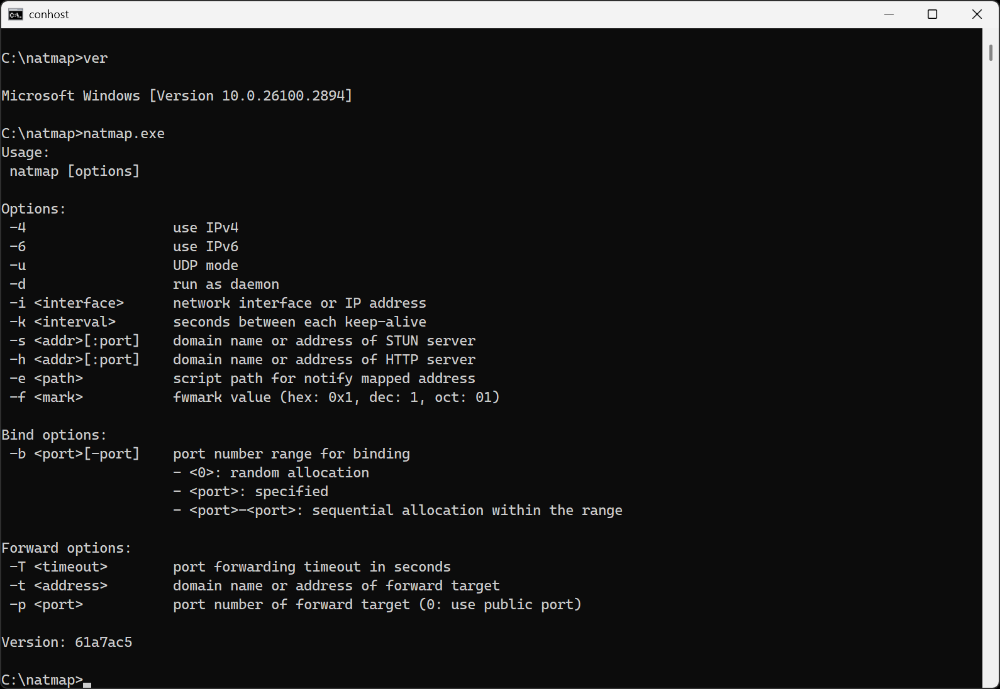

# NATMap_Win32

将 NATMap 移植到 Windows 平台。

## 现状

开坑待填。编译成功，但目前没有任何功能可用。



## 编译方法

1. 按照 [https://www.msys2.org/](https://www.msys2.org/) 步骤安装 MSYS2

2. 打开 **MSYS2 MSYS** 控制台

3. 执行以下命令：
    ```bash
    git clone https://github.com/MikeWang000000/natmap_win32
    cd natmap_win32
    bash build.sh
    ```

4. 编译产物为 `dist/natmap_win32.zip`
